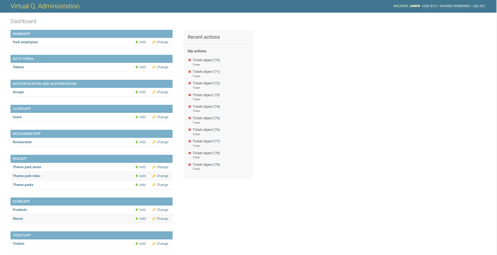
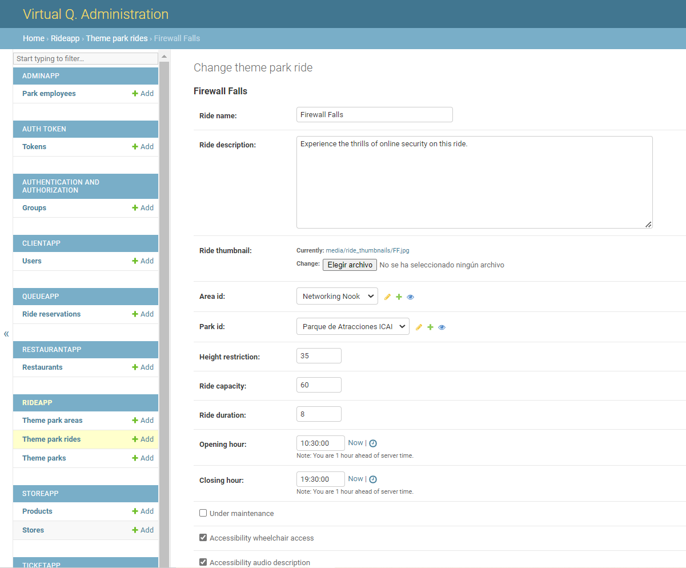
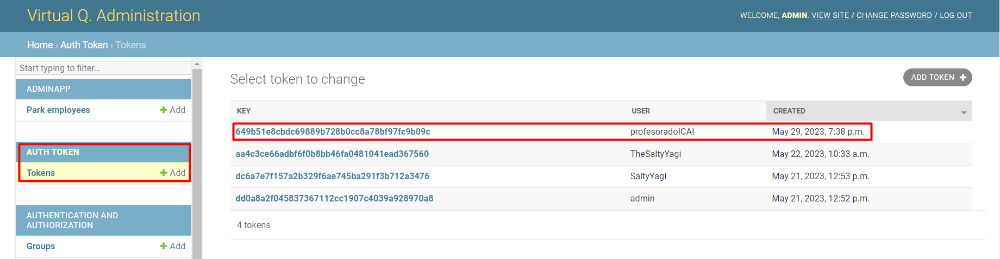
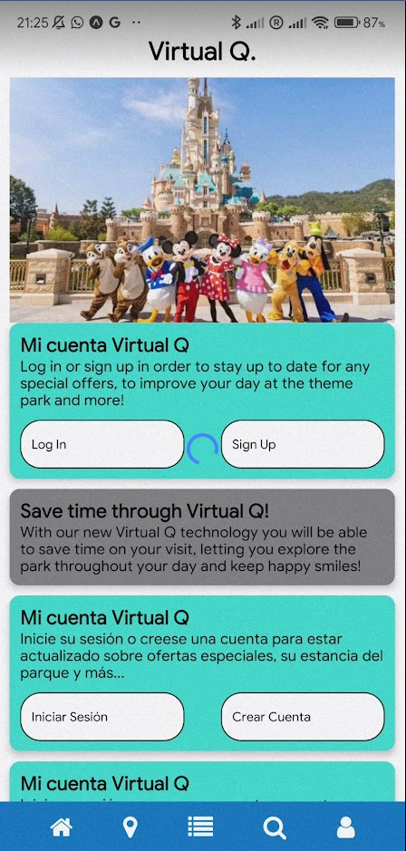
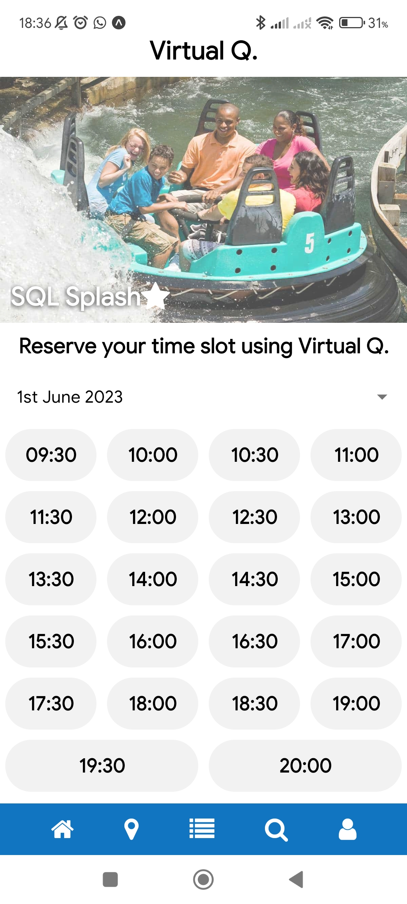
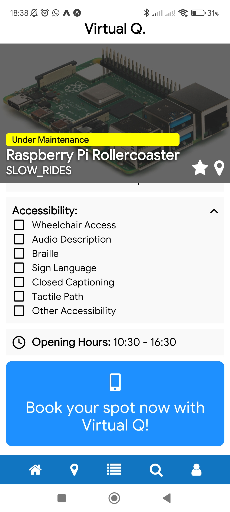
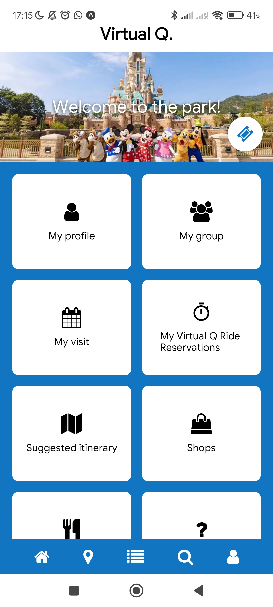
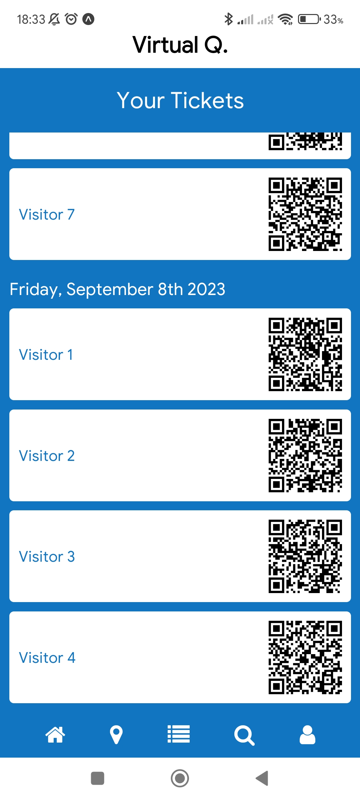
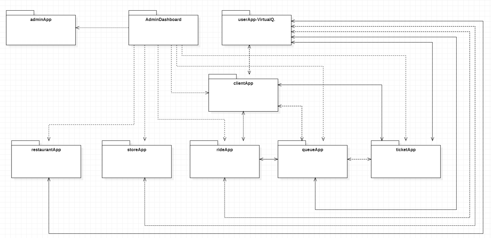
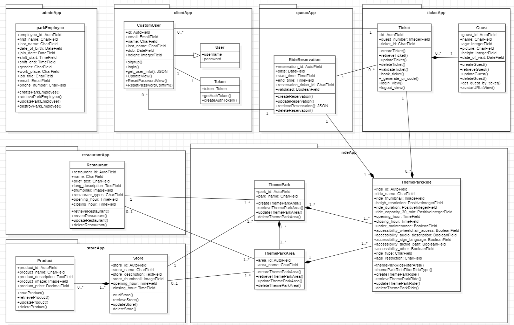

# Virtual Q - An Innovative Full-Stack Solution for Theme Parks

## Overview

Virtual Q is a comprehensive full-stack ecosystem designed to enhance the experience of both theme park managers and visitors. This project was developed as part of a final thesis in Computer Engineering at Universidad Pontificia Comillas ICAI.

## Key Features

### Manager Portal
- Dynamic management of park databases
- Control over ride information, status, and capacity
- Restaurant and store product management
- Ticket administration
- Map information updates

#### Manager Portal Preview




### User Mobile App
- Ticket purchasing
- Itinerary planning
- Advance ride booking
- Virtual queue system

#### User Mobile App Preview

_User App Homescreen modifiable_

_Reservation times for a ride display_

_Ride under maintenance set by the park manager in real time_

_Home Dashboard_

_Client tickets view for each specific day and group_

### Virtual Queue System
- Real-time status updates
- Multiple ride queue management
- Efficient booking system

## How It Works

1. **Manager Portal:**
   - Park managers can access the portal to manage the park's information, including rides, restaurants, and stores.
   - The portal allows managers to update ride status, capacity, and maintenance information.
   - Managers can also manage ticket sales and view user tokens.

2. **User Mobile App:**
   - Visitors can use the mobile app to purchase tickets, plan itineraries, and book rides.
   - The app provides real-time information on ride status, queue lengths, and booking availability.
   - Users can view their ticket information and track their progress throughout the park.

3. **Virtual Queue System:**
   - The system allows users to book ride slots in advance and receive real-time updates on the queue status.
   - Park managers can view and manage the queue status for multiple rides simultaneously.
   - Users can enjoy a seamless experience with reduced waiting times and efficient ride booking.

## Technology Stack

- **User Mobile App:** React Native
- **Backend & Manager Portal:** Django
- **Database:** SQLite

## Project Structure

Virtual Q follows a microservice-based architecture. The interaction between different components is illustrated in the diagram below:



For a detailed view of the class structure and interactions, refer to the following diagram:



## Installation and Setup

### Prerequisites
- Python 3.10
- Node.js and npm
- React Native development environment
- Django

### Manager Portal (Django)

1. Navigate to the Django project directory:
   ```
   cd path/to/django/project
   ```

2. Install required Python packages:
   ```
   pip install -r requirements.txt
   ```

3. Run migrations:
   ```
   python manage.py migrate
   ```

4. Create a superuser:
   ```
   python manage.py createsuperuser
   ```

5. Start the Django server:
   ```
   python manage.py runserver
   ```

6. Access the admin portal at `http://localhost:8000/admin` using the superuser credentials.

### User App (React Native)

1. Navigate to the React Native project directory:
   ```
   cd path/to/react-native/project
   ```

2. Install dependencies:
   ```
   npm install
   ```

3. Start the Expo development server:
   ```
   expo start
   ```

4. Use Expo Go on your mobile device to scan the QR code and run the app.

## Important Notes

- Ensure both the Django backend and React Native app are running simultaneously for full functionality.
- Check and update IP configurations in the app settings for local connections.

## Future Development

This project is a work in progress. Future updates may include:
- Deployment of the user app to app stores
- Addition of a map
- Reorganisation and tidyness of the project
- Implementation of AI for planned itineraries
- Enhanced features for both manager and user interfaces
- Integration with real-time data sources for park information

## Contributing

Contributions to Virtual Q are welcome! Please feel free to submit issues, fork the repository and send pull requests.

Project Link: [https://github.com/yagotobi/virtual-q](https://github.com/yagotobi/virtual-q)