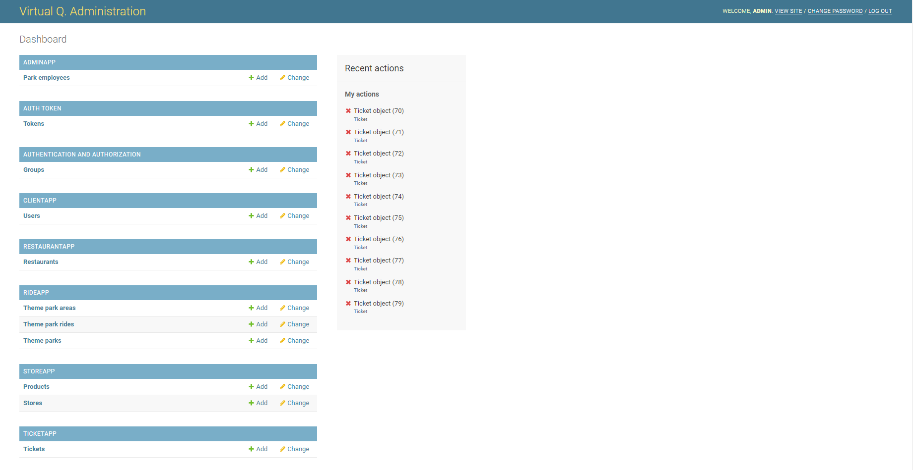
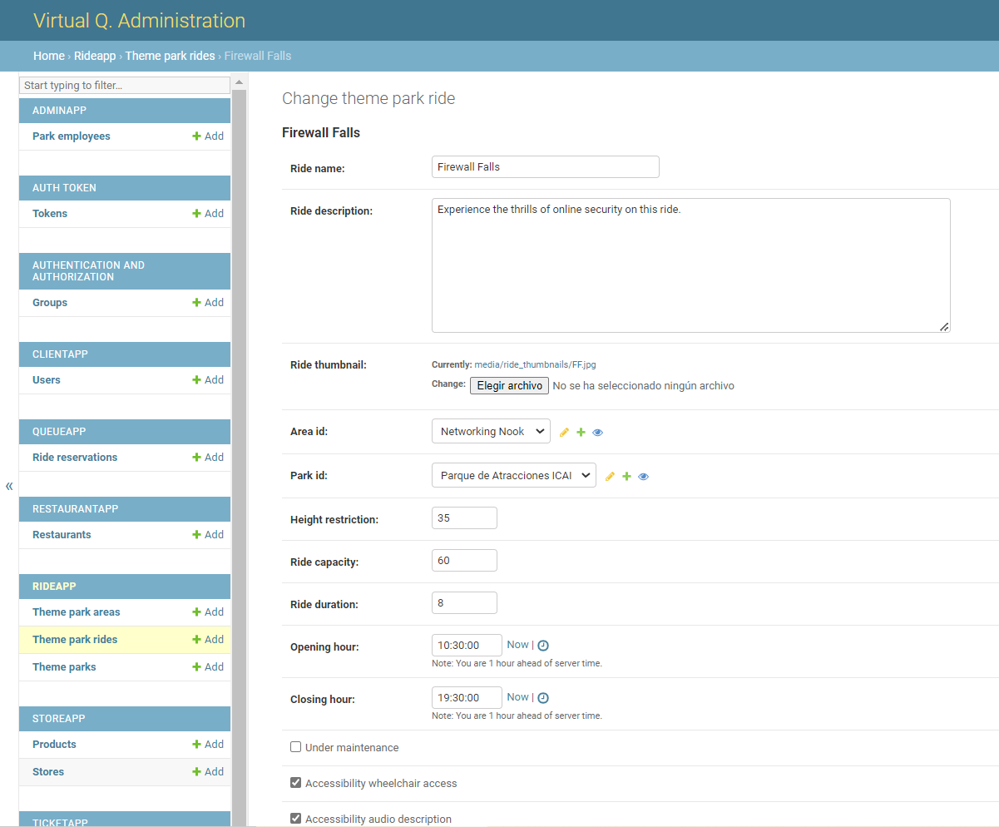
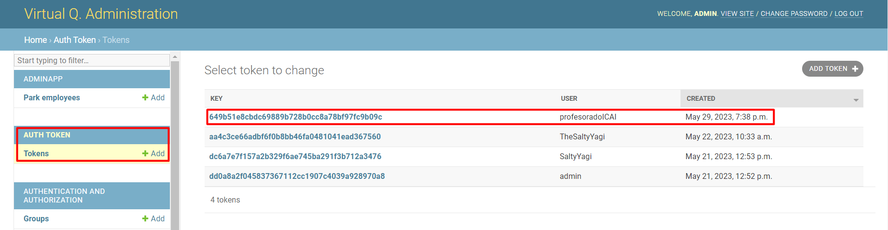
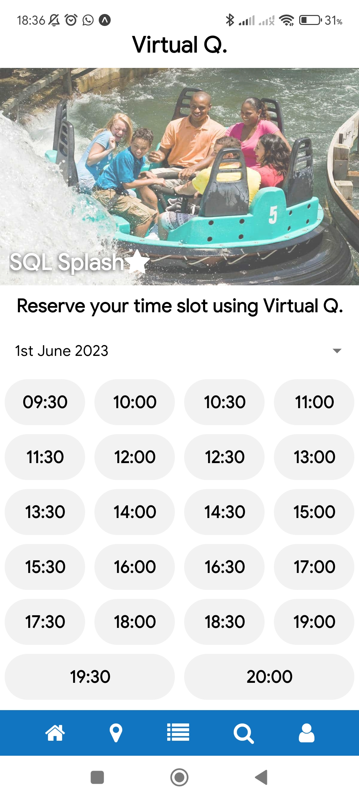
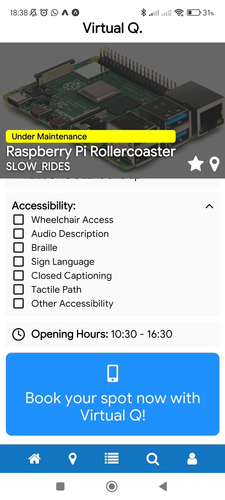
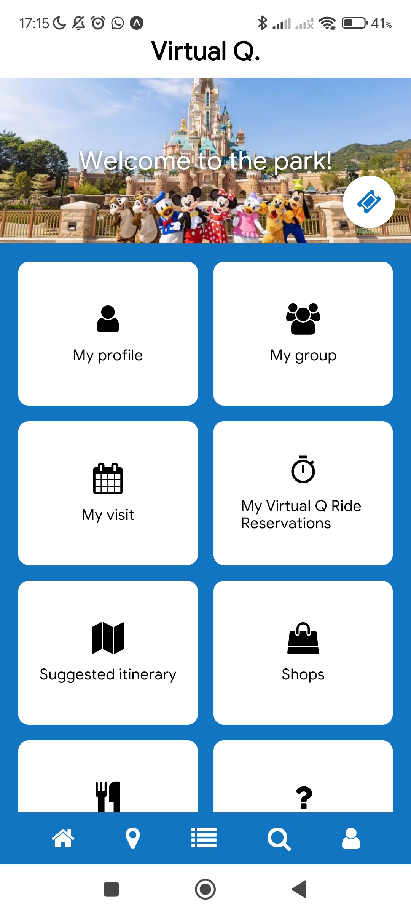
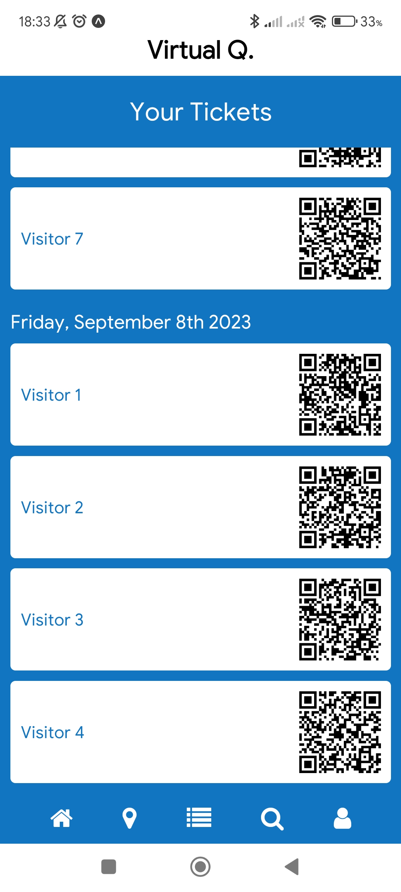
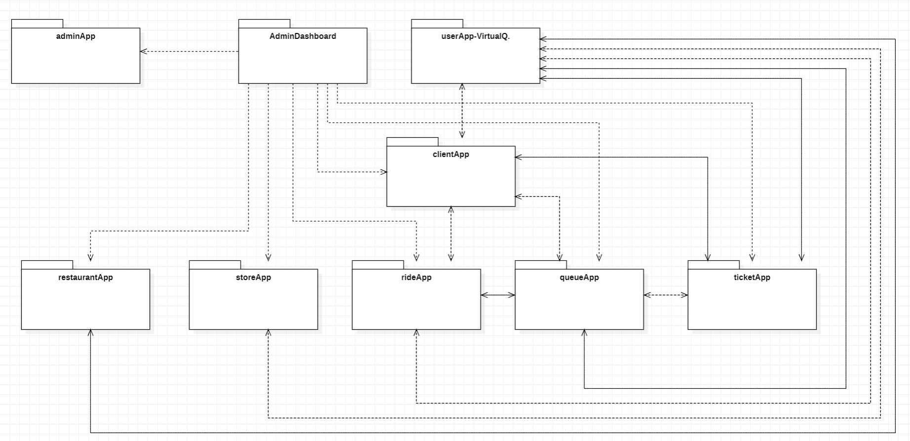
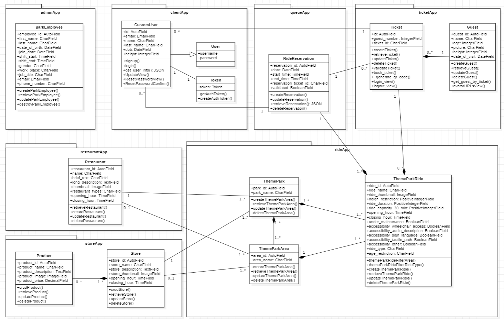

# Virtual Q - An Innovative Full-Stack Solution for Theme Parks

## Overview

Virtual Q is a comprehensive full-stack ecosystem designed to enhance the experience of both theme park managers and visitors. This project was developed as part of a final thesis in Computer Engineering at Universidad Pontificia Comillas ICAI. 

- [Project Thesis](https://repositorio.comillas.edu/jspui/bitstream/11531/74763/1/TFG%20Tobio%20Souto%2C%20Yago.pdf)
- [Project Presentation](https://www.canva.com/design/DAFfNZRYMQI/oRpC6xTuJ5Kh8G46f2VbBg/view?utm_content=DAFfNZRYMQI&utm_campaign=designshare&utm_medium=link&utm_source=publishsharelink)

## Table of Contents
1. [Overview](#overview)
2. [Key Features](#key-features)
   - [Manager Portal](#manager-portal)
   - [User Mobile App](#user-mobile-app)
   - [Virtual Queue System](#virtual-queue-system)
3. [How It Works](#how-it-works)
4. [Technology Stack](#technology-stack)
5. [Project Structure](#project-structure)
6. [Installation and Setup](#installation-and-setup)
   - [Run this prepared checkout](#run-this-prepared-checkout)
   - [Reconstruct from a fresh clone](#reconstruct-from-a-fresh-clone)
   - [Database and configuration](#database-and-configuration)
   - [Verify the restoration](#verify-the-restoration)
7. [Important Notes](#important-notes)
8. [Future Development](#future-development)
9. [Contributing](#contributing)

## Key Features

### Manager Portal
- Dynamic management of park databases
- Control over ride information, status, and capacity
- Restaurant and store product management
- Ticket administration
- Map information updates

#### Manager Portal Preview




### User Mobile App
- Ticket purchasing
- Itinerary planning
- Advance ride booking
- Virtual queue system

#### User Mobile App Preview

*Reservation times for a ride display*


*Ride under maintenance set by the park manager in real time*


*Home Dashboard*


*Client tickets view for each specific day and group*

### Virtual Queue System
- Real-time status updates
- Multiple ride queue management
- Efficient booking system

## How It Works

1. **Manager Portal:**
   - Park managers access the portal to manage park information, including rides, restaurants, and stores.
   - Managers can update ride status, capacity, and maintenance information in real-time.
   - The portal allows for ticket sales management and user token viewing.

2. **User Mobile App:**
   - Visitors use the app to purchase tickets, plan itineraries, and book rides.
   - Real-time information on ride status, queue lengths, and booking availability is provided.
   - Users can view their ticket information and track their park progress.

3. **Virtual Queue System:**
   - Users can book ride slots in advance and receive real-time queue status updates.
   - Park managers can simultaneously view and manage queue status for multiple rides.
   - The system ensures a seamless experience with reduced waiting times and efficient ride booking.

## Technology Stack

- **User Mobile App:** React Native
- **Backend & Manager Portal:** Django
- **Database:** SQLite

## Project Structure

This checkout runs as one Django application with domain apps sharing SQLite, plus an Expo mobile client. The original thesis architecture diagram is included below:



For a detailed view of the class structure and interactions, refer to the following diagram:



## Modern app preview

The migration lives in `frontend/`: Expo 57, React Native 0.86 and gluestack v5.
It currently includes phone-first Explore/search, ride details, a provisional map,
registration/sign-in/reset requests, profile editing, visit booking, ticket QR
passes and guest details. Secure native sessions survive restarts. Ride
reservations, scanning, remaining visitor flows and the custom staff portal are
still being migrated. See
[the plan](docs/MODERNIZATION.md) and [native evidence](docs/VERIFICATION.md).

With Python 3.12 and Node 22 installed:

```sh
python3.12 -m venv .venv
.venv/bin/python -m pip install -r requirements.txt
.venv/bin/python manage.py migrate
.venv/bin/python manage.py seed_demo
cd frontend
npm ci
cd ..
make backend
```

In another terminal run `make preview-android` with Pixel 10 running in Android
Studio, or `make preview` for web at `http://localhost:8081`. These use separate
Expo Go SDK 57 and SDK 48 runtimes; installing one replaces the other on Android.
The modern Android target forwards the API and Metro ports and prefers IPv4 for
localhost; an IPv6-only Metro listener failed the emulator's IPv4 connection.
For a LAN device,
set `EXPO_PUBLIC_API_URL` and configure Django's hosts/bind address as described
below. `CI=1` disables Metro watching on this Mac; restart after source edits.

Run `make check` and `make frontend-check`. To include the SQLite concurrency
cases, use a disposable test database path:
`DJANGO_TEST_DATABASE_PATH=/tmp/virtualq-tests.sqlite3 make check`.
Django creates and deletes that test file; never point it at a database you want
to keep. CI runs this file-backed concurrency check automatically.
The locked UniWind 1.11.0 /
Tailwind 4.3.2 pairing is intentional: the subsequent compiler combination rendered
desktop breakpoint styles on the phone during testing. Upgrade them together and
repeat native screenshot checks. Do not apply `npm audit fix --force`; see
[dependency findings](docs/RELIABILITY.md).

## Installation and Setup

The restored local baseline uses Python 3.12, Django 5.2, Node 22, and the original Expo SDK 48 / React Native 0.71 app. See [the audit](AUDIT.md) for the next simplifications.

### Run this prepared checkout

Open two terminals in the repository root:

```sh
# Terminal 1: Django API, admin, and ticket-booking website
make backend
```

```sh
# Terminal 2: visitor app in the browser
make web
```

Open `http://localhost:19006` for the visitor app and `http://localhost:8000/admin/` for management.

To use the Android Studio virtual device, start **Pixel 10** in Device Manager, keep `make backend` running, and run `make android` in another terminal. This installs the matching Expo Go runtime if needed, forwards the emulator's API port to Django, and opens the app. Run it in a normal terminal: this older Expo CLI's download progress display fails without a TTY. The default SDK location is `~/Library/Android/sdk`; override `ANDROID_SDK` if yours differs.

| Account | Username | Initial password |
| --- | --- | --- |
| Visitor | `demo` | `VirtualQ-demo-2026!` |
| Administrator | `demo-admin` | `VirtualQ-demo-2026!` |

The local runtime copies in `.local/` and `.venv/` are ignored by Git. `make web` prefers the prepared Node 22 copy when present. It disables Metro watching to avoid the `EMFILE` watcher error encountered on this Mac; Webpack still rebuilds browser changes. For native development with live reload, install Watchman and run `npm start` with Node 22.

### Reconstruct from a fresh clone

Install Python 3.12 and Node 22 first. The mobile directory includes `.nvmrc` for Node version managers.

```sh
# From the repository root
python3.12 -m venv .venv
.venv/bin/python -m pip install -r requirements.txt
.venv/bin/python manage.py migrate
.venv/bin/python manage.py seed_demo
cd userApp-React-Native
npm ci
cd ..
make backend
```

In another terminal, run `make web`. Use npm and the committed `package-lock.json`; the old Yarn lock has been replaced.

`seed_demo` creates a park, three rides (one under maintenance), a visitor, an administrator, and tickets for tomorrow for the visitor and two guests. It can be rerun each day to add tomorrow's tickets without resetting passwords or deleting existing records. To create your own administrator, run `.venv/bin/python manage.py createsuperuser`.

### Database and configuration

The default database is **`db.local.sqlite3`**, created by migrations. The historical **`db.sqlite3`** remains untouched. To explore historical data, copy it to a separate file and set `DJANGO_DATABASE_PATH` to that copy before migrating it. Demo seeding is optional when using historical data.

No email credentials are required: password-reset email is printed in the Django terminal. The historical `.env` is not loaded. Optional overrides go in `.env.local`:

```sh
cp .env.example .env.local
```

The API address defaults to the browser hostname or the Expo development host on native. To override it, restart Expo with:

```sh
cd userApp-React-Native
VIRTUALQ_API_URL=http://192.168.1.50:8000 npm start
```

For a physical device, put the computer and device on the same network, add the computer's LAN IP to `DJANGO_ALLOWED_HOSTS` in `.env.local`, and run Django with `.venv/bin/python manage.py runserver 0.0.0.0:8000`. Browser clients on another origin also need that origin in `CORS_ALLOWED_ORIGINS`.

Expo Go must match SDK 48. Older Expo Go builds are available for Android and iOS Simulator; SDK 48 cannot use today's App Store Expo Go on a physical iPhone. A physical iPhone needs an SDK upgrade or a compatible development build. Expo Go installation and native app launch were verified on the existing Pixel 10 Android emulator, with ride/API requests and local thumbnails served by Django during that session. Native login/booking interactions, camera scanning, and physical-device installation remain unverified.

### Verify the restoration

```sh
make check
cd userApp-React-Native
npm run build:web
npx expo export --platform android
npx expo export --platform ios
```

`make check` runs Django's system check, migration-drift check, and 11 regression tests. The tests cover account creation/login/profile/reset email, repeatable seeding, web ticket booking, reservation creation/listing/cancellation, invalid-batch rollback, maintenance/date rejection, ticket validation, and ownership isolation for the touched endpoints.

Browser walkthrough: log in as `demo` → ride-list icon → Python Plunge → book a spot → choose tomorrow and visitors → Confirm → profile icon → My Virtual Q Ride Reservations. The ticket icon on the profile screen opens the admission-ticket QR list. The ticket-booking website is at `http://localhost:8000/api/tickets/login/`.

## Important Notes

- This is a restored local prototype. Search, map, itinerary, several profile menu destinations, and the mobile cancellation handler still contain placeholders. They are not completed by this setup repair.
- Capacity enforcement, overlapping reservations, and validation on reservation edits need a separate correctness review before real park use.
- The original avatar image files under `ticketApp/profile_icons/` are missing; avatar selection remains incomplete. Existing ride thumbnails are available locally; the home/profile hero image still uses an external URL.
- Authentication currently lives in memory, so a full browser reload requires logging in again.
- Expo SDK 48 has deprecated transitive packages. The web build currently reports an optional Reanimated import and bundle-size warnings. Upgrade Expo as the next compatibility project, using this restored baseline to compare behavior.

## Future Development

This project is a work in progress. Future updates may include:
- Deployment of the user app to app stores
- Addition of an interactive park map
- Project reorganization and code cleanup
- Implementation of AI for optimized itinerary planning
- Enhanced features for both manager and user interfaces
- Integration with real-time data sources for park information

## Contributing

Contributions to Virtual Q are welcome! Please feel free to submit issues, fork the repository and send pull requests.

Project Link: [https://github.com/yagotobi/virtual-q](https://github.com/yagotobi/virtual-q)
