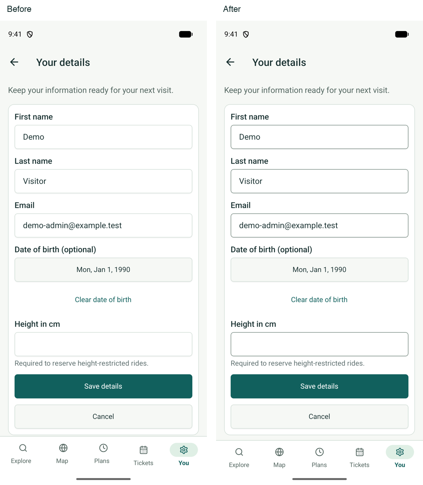
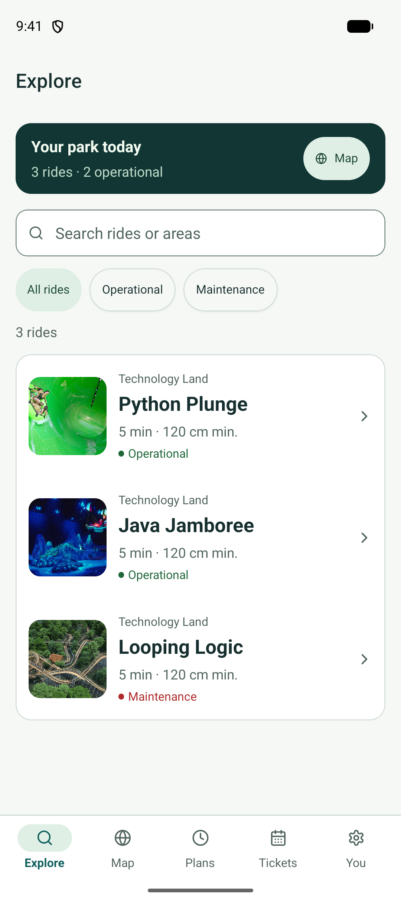
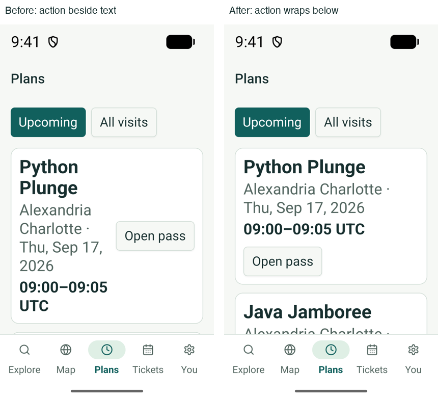

# Accessibility review

## Scope — 16 September 2026

This checkpoint reviews shared form colors and compact Android layouts. It is
not a WCAG conformance statement. Runtime evidence uses the installed VirtualQ
debug app on the Pixel 10 emulator and the first CI iPhone 17 startup capture.
Broader web and iOS runtime coverage remains open.

## Form contrast

The shared Input and Select trigger used the decorative `border` token. Its
contrast against a card was only 1.40:1 in light mode and 2.01:1 in dark mode,
making empty fields difficult to identify. They now use the dedicated `input`
token. Invalid Input outlines use the full destructive color, and Select
placeholder text uses `muted-foreground` instead of half-opacity foreground.
Decorative card borders retain their existing appearance.

Ratios below use the declared sRGB colors in `frontend/global.css`, the WCAG
relative-luminance formula and alpha compositing where applicable. Thresholds
are checked before rounding. Normal text needs 4.5:1; a boundary needed to
identify a control needs 3:1.

| Pair | Light | Dark |
| --- | ---: | ---: |
| Input boundary / card | 3.71 | 5.42 |
| Input boundary / page | 3.47 | 6.28 |
| Input boundary / input fill | 3.71 | 3.21 |
| Input placeholder / input fill | 6.11 | 4.60 |
| Invalid boundary / input fill | 6.64 | 4.60 |
| Focus boundary / input fill | 7.36 | 5.85 |
| Select placeholder / card | 6.11 | 7.78 |
| Select icon / card | 3.01 | 4.39 |
| Select focus boundary / card | 4.57 | 6.89 |

The dark input fill is the existing 30% input color over card. The app currently
selects light mode explicitly; dark values were calculated, not visually
verified. These pairs do not establish contrast for every possible override,
background, disabled state or overlay.

The Profile screen was inspected before and after restarting Metro and the
installed Android app. Empty and populated outlines are visible without changing
the form layout. No profile values were saved.

References:

- [WCAG 2.2 contrast for text](https://www.w3.org/WAI/WCAG22/Understanding/contrast-minimum.html)
- [WCAG 2.2 non-text contrast](https://www.w3.org/WAI/WCAG22/Understanding/non-text-contrast.html)

## Phone layout and motion

At 320 × 560 dp and font scale 1.6, Profile and visit-booking actions were
reachable by scrolling. Built-in native text fitting now prevents the fixed-width
tab labels from truncating; content text retains system scaling. Full accessible
tab names, selected state and touch targets remain in place.
Screenshots, restored device settings and the floating-keyboard limitation are
recorded in [verification](VERIFICATION.md#compact-phone-and-large-text-checks--16-september-2026).

The prior navigation check verified Android reduced-motion changes while the app
was mounted. See [performance evidence](PERFORMANCE.md#navigation-continuity--15-september-2026).
This does not establish screen-reader reading order or announcements.

## Native placeholder color — 16 September 2026

The first iOS startup screenshot (PR #23, run `35057206466`, commit `a451c90`)
exposed a gap between the declared token ratios above and the actual native
rendering. The search placeholder used the iOS default color, RGB
`197, 197, 199`, on white: **1.72:1**. The `placeholder:` CSS utility did not
populate the native TextInput color prop.

Both shared InputField and SelectInput now use UniWind's built-in
`placeholderTextColorClassName="accent-muted-foreground"`. This maps the
existing semantic token to the native/web color prop, retains explicit caller
overrides, and avoids a separate color resolver or hardcoded color. The input's
native focus ref remains unchanged.

After a fresh Metro bundle and app restart, the Pixel screenshot contains the
intended RGB `83, 102, 96` text on white: **6.11:1**. Entering “Python” filters
the list to one ride; clearing the field restores all three. These checks cover
the shared input's Android rendering and editing. The select is currently used
by web staff forms, whose browser interaction checks remain open.

Pixel and iOS measurements use solid text pixels inside the search field, not
antialiased edges. PR #23's startup artifacts provide subsequent iOS captures
for visual inspection; CI's catalog assertion alone does not prove contrast.

## Long reservation names — 16 September 2026

At 320 × 560 dp and font scale 1.6, keeping the pass action beside the details
squeezed a long visitor name and date into a narrow column. The gluestack HStack
now wraps, and the text column has a minimum width, so the action moves below
the details when space is limited. The normal Pixel layout keeps the action
beside the text. Both layouts were visually inspected in the installed app.

The 120-reservation fixture also exposed repeated accessible button names for
the same visitor and ride. Pass actions now include the visit date, start time
and time zone. The final native accessibility snapshot distinguishes, for
example, Python Plunge at 09:00 and 10:00 on 17 September, and 09:00 on
18 September. This verifies exposed labels, not TalkBack speech or reading order.
The fixture was removed and phone size/font settings restored after verification.

## Remaining checks

- TalkBack and VoiceOver: reading order, field/error associations, live feedback,
  route changes, dialog focus and selection announcements.
- Browser keyboard navigation, visible focus, zoom/reflow and staff tables/forms.
- Complete large-text coverage, including translated names; the Plans sample
  above covers one long English name and 120 upcoming reservations.
- Docked keyboard at compact phone dimensions and iOS keyboard/safe-area behavior.
- Runtime contrast for every state, including selection sheets and custom
  background overrides. Dark-mode runtime verification before exposing a theme
  preference.
