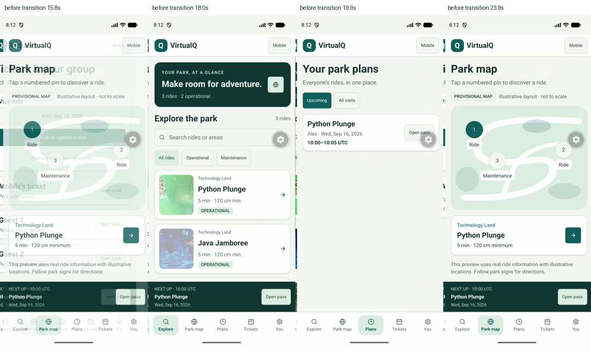
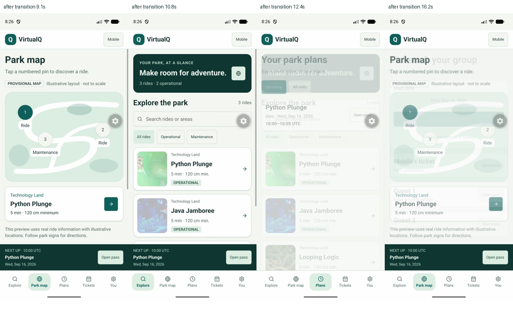

# Native performance review

Apply the installed `react-native-best-practices` skill alongside gluestack v5
and ponytail. Measure the actual interaction before changing rendering/state
patterns; repeat the same measurement after a targeted change. A component count
is context, not a performance result. Do not add memoization or another state/list
library solely because it appears in a checklist.

## Development baseline — 15 September 2026

Code: `2bac075`. Pixel 10 emulator, Android 17, Expo Go 57.0.9,
React Native 0.86.3 / React 19.2.3, three seeded rides, local Django API.
Tool: Callstack `agent-device` 0.21.3, fetched from its verified npm repository
metadata and run outside the application's dependency tree.

The React DevTools helper runs on port 8097; Android reverse forwarding and an
Expo reload connected the app. `status` and `wait --connected` confirmed attachment
before recording. The actual flow was Explore → bottom Map tab → pin 2 →
Java Jamboree details. Native accessibility diffs confirmed each outcome.

| Observation | First pass | Repeat, unchanged code |
| --- | --- | --- |
| React commits | 12 | 14 |
| Reported maximum inclusive duration | 858.023 ms | 858.023 ms (twice) |
| Sum of exclusive work in the first maximum commit | 34.041 ms | 39.082 ms |
| Largest exclusive component in that commit | Pressable, 3.296 ms | View, 0.975 ms |
| Highest reported render count | Button, 6 | navigation providers, 5 |

The exact repeated inclusive maximum and much smaller exclusive totals need
further interpretation with native frame/CPU evidence. They do **not** establish
an 858 ms visible frame stall or identify VStack as the root cause. The exports
contain component names, timing and commit data; no speculative memoization or
state-library change was applied.

Raw local exports (ignored by Git):
`.local/verification/profiles/map-detail-first.json` and
`.local/verification/profiles/map-detail-repeat.json`.
Recording windows include operator pauses; their elapsed duration is not TTI.
These development/Expo Go traces are not release FPS or physical-device evidence.

The CLI is run with `npm exec --yes --package=agent-device@0.21.3 -- agent-device`.
The following commands assume that pinned CLI is on PATH. Reproduce with the app
open and connected:

```sh
agent-device react-devtools status
agent-device react-devtools wait --connected
agent-device react-devtools profile start
# Perform the same map/pin/detail interaction using current native element refs.
agent-device react-devtools profile stop
agent-device react-devtools profile slow --limit 5
agent-device react-devtools profile rerenders --limit 5
agent-device react-devtools profile timeline --limit 20
agent-device react-devtools profile export profile.json
```

## Remaining measurements

- Frame/CPU evidence for route transitions; repeat after the visitor navigation
  and forms migration using the same build type and dataset.
- Larger ride/ticket lists: measure eager mounting/scrolling before choosing
  FlatList or another virtualized list. Never nest a virtualized list in the page's
  vertical ScrollView. Preserve dynamic row height for font scaling.
- Text input and date/group selection: record the input interaction itself.
- Cold-start TTI, memory and native binary size on a development/release build;
  Expo Go's host application cannot prove VirtualQ release startup/size.
- Bundle attribution with Expo Atlas/source maps. Current export baselines are
  1.7 MB web JS + 42 KB CSS, 3.6 MB Android Hermes, 3.3 MB iOS Hermes. These sizes
  alone do not identify the heaviest modules.
- Android 16 KB binary alignment and a physical-device/iOS runtime pass when
  producing native release builds.

## Reservation implementation — 15 September 2026

Plans use the built-in FlatList outside the page ScrollView, with stable
reservation IDs and dynamic row heights. This avoids eagerly mounting an
unbounded reservation history without adding another list dependency. It is an
implementation choice, not a measured FPS improvement. Large-history profiling
is still required.

The next-plan clock runs only while its route is focused and cleans up on blur.
Requests use the existing abort/timeout boundary and refresh after navigation.
Booking options require three database queries independently of party size;
remaining capacity and own-ticket conflicts are computed from that result.

The reservation export contains sixteen web routes (1.8 MB JS + 42 KB CSS);
Android/iOS Hermes exports are 3.7/3.4 MB. These remain JavaScript export sizes,
not installed native binary sizes. No release performance claim is made.

## Navigation continuity — 15 September 2026

Baseline at `6be6885`: Tickets was opened for September 16, then the sequence
Park map → Explore → Plans → Tickets → Park map was recorded on the same Pixel.
Returning to Tickets reset the date to September 15 and replaced the three passes
with an empty state. Frame inspection also showed repeated headers and bottom
controls sliding across each other because every route owned a whole page shell.

The targeted change uses one persistent visitor shell, JavaScript Tabs with a
native stack per destination, and a 160 ms native-driven tab fade. Existing
screens stay mounted, and focus refreshes retain matching data. No animation,
cache, memoization or state library was added. The same tab sequence retained
September 16 and all three passes; sampled transition frames show the header and
bottom controls staying in place.




Local raw evidence is ignored under `.local/verification/`: `virtualq-nav-before.mp4`,
`virtualq-nav-after.mp4`, `nav-before-frames/`, `nav-after-frames/` and
`navigation-reduced-motion.txt`. Frames were sampled at 100 ms using AVFoundation.
The header region (0,72)–(540,150) in 540 × 1212 recordings changed materially in
24 of 242 baseline samples and 0 of 186 revised samples (more than 2% of pixels
changing by over 16 RGB levels). This supports header stability only; clip length,
operator pauses and 10 Hz sampling cannot establish FPS or transition latency.

With React DevTools attached, Android’s transition animation scale was changed
from 1.0 to 0. The mounted VisitorStack’s reduced-motion context changed from
false to true, then back to false after restoring 1.0. App preferences follow the
OS without reloading. iOS/browser runtime preference checks remain outstanding.

## Operations export checkpoint — 15 September 2026

The staff workspace uses server-side search and 25-row pages (100 maximum).
Related-name fields use joined queries in the catalog endpoints. The browser
implementation is selected through `.web.tsx` modules; native operations routes
return to the visitor app.

The combined export produced 75 static entries including route-group aliases,
approximately 2 MB main web JavaScript plus 45 KB additional JS and 47 KB CSS,
and 3.8/3.4 MB Android/iOS Hermes bundles. The previous navigation checkpoint
was 1.8 MB main web JS and 3.7/3.4 MB Hermes. These are rounded build output sizes,
not startup-time, memory, FPS or native installation measurements.

The Pixel regression kept the 16 September party selection across Map/Tickets
and the visitor chrome remained in place. This check does not replace the
navigation measurements above or establish release performance.

## Android binary baseline — 16 September 2026

The first verified arm64 debug APK is 93,194,006 bytes. It runs as
`com.virtualq.app` on the Pixel 10, whose reported page size is 16,384 bytes.
APK zip alignment passes the SDK's 16 KB check. This is the APK file size,
not installed disk use, memory consumption or release download size.
Debug signing, Metro-delivered JavaScript and development tooling make it
unsuitable for release FPS or cold-start comparisons. Release profiling and
ELF alignment review remain open.
