# Product verification

## Framework static assets — 16 September 2026

On `codex/virtualq-static-assets`, 165 checked-in vendor files were compared with
official Django 4.1.9 and DRF 3.14.0 wheels. All matched, apart from line endings
in one license file. The old copies were removed so installed Django 5.2.17 and
DRF 3.18.1 provide their own static assets.

- `findstatic --first` now resolves Django admin and DRF CSS to the installed
  packages; app CSS still resolves to the repository's app-owned file.
- `collectstatic` produced 164 files in a temporary directory. Current admin
  CSS/scripts, DRF CSS, app CSS and a profile icon matched their source bytes.
- The live `/admin/login/` returned 200, and all seven referenced local
  styles/scripts returned the installed asset bytes over HTTP.
- `manage.py check` passed. No model, migration, database or visitor UI changed.

Desktop visual inspection is still open. Chrome on the emulator stopped at its
first-run terms screen; no terms were accepted during this check.

## Password-change session checks — 16 September 2026

On `codex/virtualq-session-revocation`, the installed `com.virtualq.app` Android
debug binary loaded the updated JavaScript from Metro on Pixel 10:

- Signed in as a newly created synthetic visitor.
- Submitted the live Django reset confirmation using an HTTP client with the
  session cookie and CSRF token. This was not a browser form walkthrough.
- Confirmed the old API token was removed and Tickets refused the old session.
- Signed out successfully despite the already-revoked token.
- Signed in on Pixel with the changed password and reached the correct account.
- Removed the temporary visitor and its token after checking it had no tickets.

All 62 backend tests passed with a disposable file-backed SQLite database,
including the existing concurrency cases. System checks, migration-drift checks,
type checking, lint and seven frontend tests passed. The final session-error copy
is covered by the shared API test; this checkpoint introduces no layout changes.

Desktop browser inspection remains open: both Safari and Zen control returned
`cgWindowNotFound`. Password reset templates, the remaining staff browser flows,
release signing, iOS and physical-device checks retain their earlier limitations.

## Foundation — 15 September 2026

Environment: Pixel 10 Android Studio emulator, Android 17 / API 37, arm64,
1080 × 2424 px, density 420; Expo Go 57.0.9. Local Django demo data only.
Native screenshots and taps used ADB after the computer-control tool could not
attach to the emulator window.

Verified on the actual emulator:

- Explore loads real API ride names, local images and maintenance status.
- Search for “Python” reduces the list to Python Plunge.
- Bottom navigation reaches the provisional map and account screen.
- Map pin 2 selects Java Jamboree; its details action opens that ride.
- Sign in as the demo visitor with the software keyboard open. Both fields and
  the submit action remain visible, and the bottom tabs yield space to the keyboard.
- Successful authentication closes the keyboard and displays the demo profile.
- Force-stop and reopen Expo Go: the saved secure token restores the demo session.
- Sign out returns to Explore with the unauthenticated header.

Screenshots use seeded demo data. The floating gear is Expo Go's development
overlay. These are runtime captures, not design mockups:

| Explore | Sign in with keyboard | Restored account |
| --- | --- | --- |
|  |  |  |

| Provisional map | Compact ride details |
| --- | --- |
|  |  |

The first native renders revealed a responsive compiler regression in
UniWind 1.12.0 / Tailwind 4.3.3. The pinned UniWind 1.11.0 / Tailwind 4.3.2
combination renders the phone layout correctly. The map also exposed an
unnecessary clipped decorative label; it was removed. The large ride-detail
image/title were reduced after visual inspection. A fresh Metro restart and
native walkthrough verified the corrected map, its detail link and the compact
ride page at `247ddfc`; screenshots above show that final sizing.

Automated foundation checks: clean `npm ci`, TypeScript, ESLint and
`expo install --check` pass. Web static export passes (seven routes; 1.7 MB JS,
42 KB CSS); Android/iOS Hermes exports pass (3.6/3.3 MB). These are JavaScript
exports, not native binary builds. Source checks now exclude generated exports:
the first parallel export/typecheck exposed a stale generated-file inclusion.
The scoped xcode UUID override generated 100 unique valid project identifiers.
The npm high-severity audit gate passes with three tracked moderate findings.
Draft PR: [#2](https://github.com/yagoTobi/VirtualQ-Final-Version/pull/2).
GitGuardian scanned the initial four commits without finding new secrets.
GitHub rejected the first workflow before running jobs because `runner.temp` was
used in job-level `env`, where the runner context is unavailable. The test path is
now set at step scope. The corrected push and PR runs passed at `c4b68f9`
([PR run](https://github.com/yagoTobi/VirtualQ-Final-Version/actions/runs/34939340782)),
including all 22 backend tests, clean npm install, types/lint, dependency alignment,
the high-severity audit gate and web/Android/iOS exports.

The shared HTTP client now combines screen cancellation with its own timeout;
previously supplying a screen signal bypassed the timeout. Two Node regression
tests cover both abort paths, an already-cancelled request, authentication headers,
structured API errors and empty cancellation responses. These use the actual
TypeScript client with mocked platform imports/network and add no test dependency.
The push and PR runs also pass at `247ddfc`, including these request tests
([PR run](https://github.com/yagoTobi/VirtualQ-Final-Version/actions/runs/34939801521)).

## Visitor accounts and tickets — 15 September 2026

On the same Pixel emulator, using a newly created synthetic local QA account:

- Registered, reached the account screen and restored the session after restarting.
- Opened Gboard on the long registration form. Shared page-level keyboard
  avoidance makes the final fields and Create account button reachable; bottom
  navigation yields the keyboard space.
- Selected September 16 in the native date picker and booked two additional
  guests. All three passes appear in the compact ticket list without scrolling.
- Reopened the visit with two guests prefilled and saved it again. The group
  remained intact. Attempting to reduce it showed explicit removal/cancellation
  counts; “Keep current group” returned to all three passes.
- Displayed a guest QR and edited the guest's name, age and height. The refreshed
  pass showed the new name. A separate read of this QA record confirmed persistence.
- Decoded the actual screenshot's QR with macOS Vision and compared its payload
  to that QA guest's stored ticket code. They match. This verifies the displayed
  QR; it is not a camera-scanner walkthrough.
- Updated the account holder's height and verified persistence.
- Signed out and submitted a reset request. The UI displayed the generic inbox
  confirmation. Local Django uses console email; production delivery was not tested.
- Submitted the sign-in username through an Android editor key event. Focus moved
  to Password through the native ref. The full registration “Next” sequence remains
  part of the broader keyboard/accessibility pass.

| Registration with Gboard | Compact tickets |
| --- | --- |
|  |  |

| Guest pass before editing | Reset request confirmation |
| --- | --- |
|  |  |

The screenshots contain synthetic local data only. Native date picking uses
Expo's pinned `@react-native-community/datetimepicker` 9.1.0. Web uses the browser's
date input with gluestack labels. TypeScript, lint and two shared HTTP regression
tests pass. The visitor web export now contains thirteen routes (1.8 MB JS,
42 KB CSS); Android/iOS JavaScript exports passed earlier in this workflow pass.
CI must verify the final commit again after the last form refinements.
Desktop interaction verification is pending: computer control could not attach to
Zen (`cgWindowNotFound`) or Safari (`timeoutReached`) in this pass. Build/export
success does not substitute for that walkthrough.

The RN performance skill and development profiling results are recorded in
[PERFORMANCE.md](PERFORMANCE.md). No release FPS/TTI improvement is claimed.

## Initial reservation regression pass

All 22 backend tests pass with `DJANGO_TEST_DATABASE_PATH` set to a fresh temporary
SQLite file. Coverage now includes opening/closing boundaries, same-day past
times, absent height, cross-ride overlap, adjacent intervals, peak occupancy,
batch rollback, released capacity, rescheduling, admission fields, preserved
duration and malformed filters. Two concurrent connections competing for one seat
produce exactly one successful booking. This is API/database evidence; native
reservation forms still need migration and the subsequent walkthrough.

## Native ride reservations — 15 September 2026

On the same Pixel 10 / Expo Go environment, with the synthetic QA party:

- Chose the account holder and one height-eligible guest for Python Plunge on
  September 16 at 10:00. A guest without the required recorded height was
  disabled, with a reason and a details action.
- Reviewed names, date, start/end time and park time zone before confirming.
  Confirmation produced two separate passes in the compact Plans list.
- Opened the account holder's ride QR. macOS Vision decoded the actual screenshot,
  and the result matched that QA reservation's stored code.
- Opened cancellation, chose “Keep reservation”, then reopened it and confirmed.
  Only the account holder's reservation disappeared; the guest's pass remained.
- Opened Explore's next-plan banner before and after cancellation. Its action
  first opened the account holder's pass, then the remaining guest's pass after
  the screen refocused. The five bottom destinations remain visible and usable.
- Restarted Metro and Expo Go with the final UI refinements. Native accessibility
  labels now identify visitors by name and party position instead of ticket IDs.
  Selecting the already-booked guest disables 10:00 while adjacent choices remain
  available. The other guest remains disabled for missing height.

| Visitor eligibility and conflict | Review before booking |
| --- | --- |
|  |  |

| Compact plans | Ride QR |
| --- | --- |
|  |  |

| Individual cancellation | Dynamic bottom banner |
| --- | --- |
|  |  |

All captures contain synthetic local QA data. The QR shown above was subsequently
cancelled. The floating gear belongs to Expo Go, not VirtualQ.

Automated checks: 36 Django tests pass on a disposable file-backed SQLite database;
three frontend request/navigation tests, type checking and lint pass. The added
API tests cover availability capacity/conflicts, recorded-height eligibility,
three view queries, privacy, past-time/maintenance filtering, admitted/finished
cancellation restrictions, QR ownership and calendar/duration overflow.
The final overflow regression was also rerun after strengthening its last-date
case; migration drift is absent.

Web export passes with sixteen routes (1.8 MB JS + 42 KB CSS); Android/iOS Hermes
exports pass at 3.7/3.4 MB. CI must recheck the committed final refinements. These
are JavaScript exports, not native binary builds. Desktop browser interaction
remains pending; computer control still reports no attached browser provider.

The reservation push and PR CI runs both passed at `d5082a5`, including
GitGuardian: [PR #4](https://github.com/yagoTobi/VirtualQ-Final-Version/pull/4),
[PR run](https://github.com/yagoTobi/VirtualQ-Final-Version/actions/runs/34952801376).

## Ticket scanner — 15 September 2026

Verified on the Pixel 10 using Expo Go and the same synthetic QA account:

- Declined camera permission and used manual entry. An unknown code produced
  a useful error; the guest's code found Alex's September 16 ticket and explicitly
  identified it as a future visit.
- Inspected the final permission-denied feedback and manual fallback on the phone.
- Granted one-time camera permission. The final version opens the preview
  immediately; the first implementation incorrectly needed a second tap because
  Android's permission dialog temporarily changed app foreground state.
- Scanned the synthetic QR through the native camera callback. Django received
  one successful lookup, the camera closed, and the screen displayed the matching
  guest and date. “Open this pass” reached that guest's existing QR/details page.
- Native configuration introspection includes camera permission and omits iOS
  microphone permission and Android audio recording permission. Expo Go displays
  its own host permission text; standalone binary permissions remain build checks.
- Reopened Tickets after restoring the normal emulator camera. All three party
  passes, the scanner entry and the next-plan banner fit in the Pixel viewport.

| Camera declined, manual entry available | Result from native camera scan |
| --- | --- |
|  |  |

The camera test used the Android emulator's documented
`-camera-back imagefile:/absolute/path/to/qa.png -no-snapshot` option. The ordinary
virtual scene showed a calibration pattern. A 1024 × 1024 RGB image with a
296 × 296 synthetic QR at (150, 364) placed the code inside this emulator's cropped
camera frame. This was image input to the native camera, not an injected JavaScript
barcode event. The automation helper timed out while capturing the successful
transition; the subsequent API log and inspected screenshot confirmed the result.
Afterward the device was restarted without the camera override. No AVD camera
configuration, historical database or real visitor record changed.

All 38 Django tests pass on file-backed SQLite, including date classification,
malformed/ambiguous codes, private responses and indistinguishable foreign/unknown
ticket errors. Types, lint and three frontend tests pass. Exports pass: seventeen
web routes (1.8 MB main JS, 45 KB additional JS, 43 KB CSS), Android/iOS Hermes
3.7/3.4 MB. No physical camera, iOS runtime or desktop camera walkthrough is claimed.

The scanner's initial CI passed types, tests and lint but failed Expo's online
version check after Expo 57.0.23 was published. The project now pins that patch
and Babel preset 57.0.12. Local compatibility/audit gates and all platform exports
pass again; a fresh Metro/Expo Go launch visually confirmed the compact Tickets
layout. Android's Hermes bundle hash is unchanged by this patch. Native iOS
scene-life-cycle changes are not verified by an iOS JavaScript export.
The scanner push and PR checks, including GitGuardian, pass at `6be6885` (PR #5).

## Persistent mobile navigation — 15 September 2026

The Pixel 10 check reproduced two issues in the original navigation: tab changes
slid duplicate headers/bottom controls across each other, and Tickets reset
September 16 to September 15 on a roundtrip. The revised layout keeps one header,
bottom bar and next-plan component, with a native stack for each tab and a short
160 ms tab fade.

Verified with the synthetic QA account:

- Tickets → Park map → Explore → Plans → Tickets retained September 16 and all
  three passes. A date manually changed to September 17 also survived a Map
  roundtrip. Both dates are future visits relative to September 15.
- Opening a park pass, returning to the group, opening/backing out of visit
  booking and opening/cancelling profile editing reached the expected screens.
- Returning from the scanner retains the selected date and passes, even when
  the back link omits date parameters. Choosing September 17 in the visit form
  and returning explicitly updated the existing Tickets tab; selecting September
  16 again restored the three passes.
- Leaving an open pass for Map and returning to Tickets reopened the same pass.
  Pressing the active Tickets tab again returned to the existing group/date.
  Map pin 2 and the Java search also survived navigation; the search was cleared
  after verification.
- Repeated sign-out/sign-in returned to Tickets. Native keyboard submission and
  the form button closed the keyboard and restored the five bottom tabs and
  next-plan banner. Android reported `mInputShown=false` after submission.
- After visiting Account and signing out, Android Back from the Tickets sign-in
  prompt returned to Explore. Protected account/profile history no longer sends
  the visitor back into sign-in. Stored authentication was restored on a fresh
  Expo Go launch.
- Android's animation scale was toggled from 1.0 to 0 with React DevTools
  connected. The mounted stack's reduced-motion context changed false → true,
  then back to false when 1.0 was restored. No reload was required.

| Phone tickets and persistent bottom controls | Compact account panel |
| --- | --- |
|  |  |

Transition frame comparisons and sampling limits are in
[PERFORMANCE.md](PERFORMANCE.md#navigation-continuity--15-september-2026).
The account card now relies on the global Tickets/Plans tabs to save space and
avoid duplicate navigation paths. The provisional map and Explore panels remain.

Type checking, lint and five frontend tests pass. New hook tests cover retained
content during refocus/reload, offline error feedback, revoked-access clearing,
account/date isolation and ignored late responses. Web and Android/iOS JavaScript
exports pass; the nested route groups produce 62 static entries including aliases
for the same 17 public routes (15 visitor routes plus sitemap/not-found).
The web main bundle remains 1.8 MB plus 45 KB additional JS and 44 KB CSS;
Android/iOS Hermes exports remain 3.7/3.4 MB. CI rechecks the final committed tree.
No release FPS, physical-device, iOS runtime or desktop interaction result is
inferred from these checks.

## Staff workspace and Android regression — 15 September 2026

The web-only `/operations` layout covers ten managed resources and read-only
visitor account lookup. It uses the shared gluestack cards, inputs, buttons,
checkboxes, selectors and modal API. Browser date/time/file controls and semantic
table elements are intentional web primitives. The visitor app's native routes,
five bottom tabs, Explore panels, provisional map and next-plan banner remain.

Safari walkthrough, using only the synthetic demo staff account:

- Staff sign-in and restored browser session; sidebar, overview and ride table
  rendered with the shared colors and spacing.
- Empty park submission showed server validation at the form and field.
- A draft survived Cancel → Keep editing. Saving added the record, updated the
  table/count and closed the dialog. The two synthetic parks were then removed
  through the staff API after checking that neither had related records.
- The long ride form scrolled within its dialog while keeping actions visible.
  The ride-type selector exposed the model choices. Nested park/area search used
  the staff session; an area result displayed **Technology Land**, not its parent
  park's name.

These checks found and fixed three integration defects: the desktop Box inherited
a column layout, Reanimated exit views left a completed dialog on screen, and
the overlay host sat outside the auth provider. The web modal now closes without
an exiting animated view, and auth wraps the gluestack overlay host.

The Pixel 10 / Expo Go regression restored the existing native session and
rendered Explore with its bottom controls. The 16 September ticket deep link
showed the holder and two guest passes; Tickets → Map → Tickets retained the date
and group. Lost ADB reverse mappings initially prevented Expo from reaching
Metro; restoring ports 8000 and 8081 resolved that environment issue.

Validation: 54 backend tests using disposable file-backed SQLite, six frontend
tests, type checking, lint, Expo alignment and the high-severity audit gate pass.
The audit still reports three moderate frontend findings. Web and Android/iOS
JavaScript exports pass; CI repeats the checks on the committed branch.

This is a staff preview checkpoint, not complete browser or accessibility
coverage. The computer-use bridge exposed table rows as cells and returned
`noWindowsAvailable` for coordinate actions, so row-edit/delete/admission
interaction checks remain pending; their API rules are covered by regression
tests. Full image-upload forms, narrower browser layouts and all role-specific
screens also need a browser pass. No physical device, native release binary,
iOS runtime, production deployment or release performance result is inferred.

## Native layout checkpoint — 15 September 2026

Pixel 10 / Expo Go: native headers and back controls replace the branded web
header. Explore shows all three demo rides without scrolling; the bottom banner
and five tabs remain. Compact card spacing keeps the ride booking action above
the navigation bar. Tickets use full-row touch targets.

Tickets for **16 September (a future visit)** retained the holder and two guest
passes through Map → Tickets. A separate native check selected map pin 2,
opened Java Jamboree, opened its booking form, then used Android Back twice:
it returned to the map with pin 2 still selected. The booking form correctly
defaulted to 15 September and showed no tickets for that day; no booking was
submitted during this navigation check.

Type checking, six frontend tests, lint, web export and Android/iOS JavaScript
exports pass locally. New routes reuse the existing ride and reservation
components. This does not establish release FPS, cold-start time, iOS runtime,
large-font coverage or complete native design parity. Pull-to-refresh is
implemented; its gesture and error-state walkthrough remains open.

## Native map checkpoint — 15 September 2026

Pixel 10 / Expo Go verification covered the expanded map, compact ride panel,
next-pass banner and five tabs. Map pin 2 → Java Jamboree → Android Back retained
the selected pin. All rides → search “Java” → ride details → Back retained the
query; clearing the search and selecting Maintenance showed only Looping Logic.
Returning to the map retained pin 2.

The emulator was temporarily set to 840 × 1470 px at density 420
(320 × 560 dp), first at font scale 1.3 and then 1.6. The initial check exposed
colliding map labels and broken tab text. After the correction, tabs fit on one
line and scrolling exposed the selected ride, maintenance status and All rides
action. The original 1080 × 2424 px, density 420 and font scale 1.0 were restored.
The floating Tools control in screenshots belongs to Expo Go.

Safari rendered the shared schematic and retained Java Jamboree after
Map → ride details → Back to map. This check also found native-only text
properties being forwarded to web spans; those props are now native-only and
the web warning is gone after reload.

Type checking, lint, six frontend tests and combined web/Android/iOS JavaScript
exports passed. No dependencies were added. This does not establish native
binary compatibility, release FPS, iOS runtime, a full six-pin visual check,
long ride lists or a full accessibility audit.

## Installed Android app — 16 September 2026

An arm64 debug APK built from the generated Expo Android project and installed
as `com.virtualq.app` on the Pixel 10. The build uses Node 22, Temurin
17.0.20.1+1, Gradle 9.3.1 and NDK 27.1.12297006. Android Studio's bundled Java 25
failed CMake configuration; Java 17 passed. Reproduction and CI artifact
instructions are in [Native builds](NATIVE_BUILDS.md).

The installed app loaded the three seeded rides, retained Map pin 2 through
ride details and Back, and signed in with the synthetic demo staff account.
Installing the final APK over that app and force-stopping/restarting it retained
the secure session. The native date dialog opened and cancelled successfully.
Camera permission was granted for this session only; the emulator's virtual
scene rendered in the preview and Close camera stopped it.
With Android dark mode temporarily enabled, the app and native date dialog
retained the configured light appearance. Dark mode, screen size, density and
font scale were restored to their original settings after testing.
The demo account also created a holder-only visit for 17 September and opened
its park-admission QR. Ride booking correctly disabled the holder because the
profile had no recorded height. That temporary ticket had no guest or reservation
and was removed after verification; the original six tickets remain. Both local
and historical databases passed the hierarchy audit again through read-only
connections.

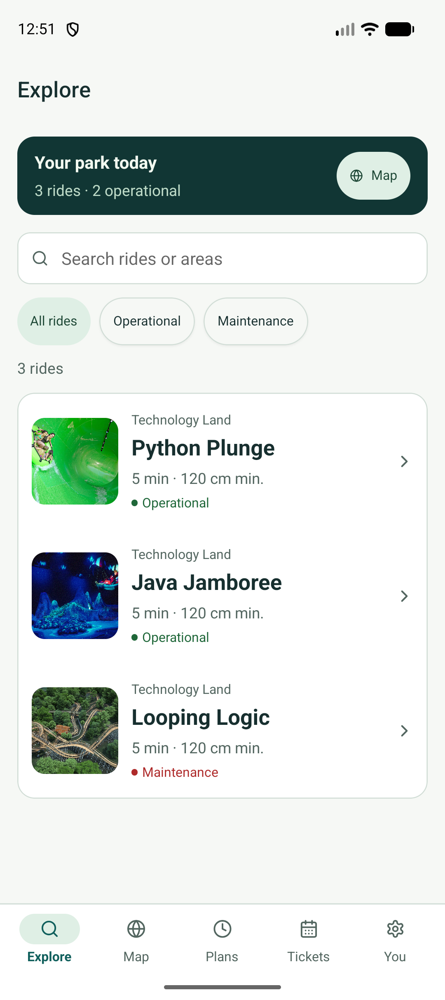
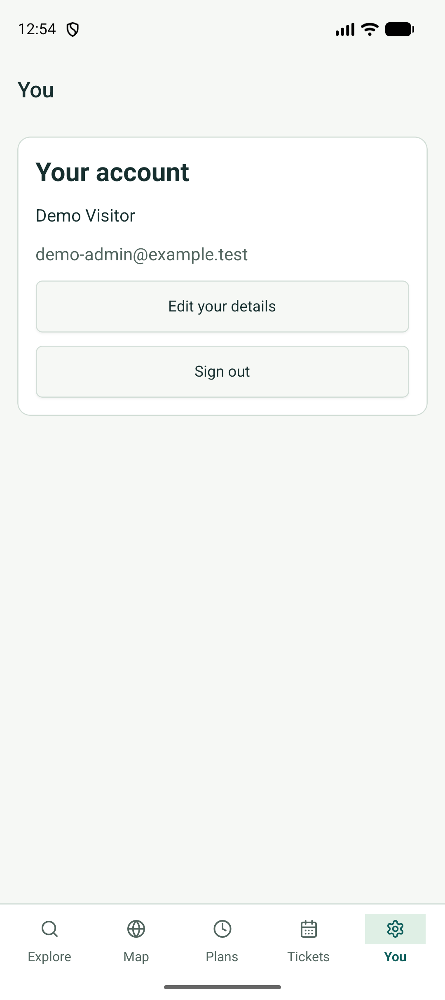
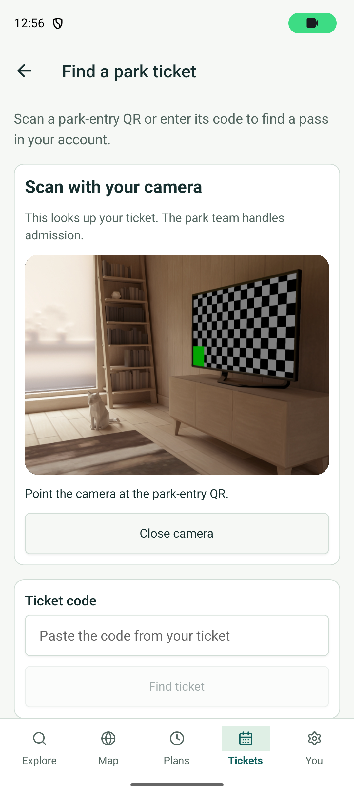

The locally built APK is 93,194,006 bytes, SHA-256
`58357a98e94811a7f5ca3607e956446807db516ad76f68f9765d66f63cc69ddc`.
Its merged manifest has camera access and no microphone or legacy external
storage permissions. The emulator reports a 16,384-byte page size; APK zip
alignment passed `zipalign -c -P 16 4`. The crash buffer was empty after these
checks. This is not an exhaustive crash test or an ELF/release alignment audit.

Type checking, lint, six frontend tests and Expo dependency alignment pass.
The high-severity npm audit gate passes with three moderate findings still
reported. Native library deprecation warnings remain in the Gradle log.
This debug APK requires Metro and is not a signed production release. This pass
did not repeat camera QR decoding, group updates, ride confirmation or
cancellation in the installed binary; earlier Expo Go evidence remains separate.

Push run `35038105768` and PR run `35038161790` passed frontend, backend,
Android build and zip-alignment checks. The PR's downloaded APK also installed
on the Pixel and retained the demo session. Its first launch produced a
development state-update warning in Expo Router's initial-link handler
(`expo-router/build/fork/useLinking.native.js:127`). One subsequent cold launch
did not repeat it; Explore and account navigation worked. This remains an
open startup/deep-link diagnostic, not a suppressed warning or a release claim.

## Shared recovery checkpoint — 16 September 2026

The installed Pixel 10 debug app opened a valid `virtualq://set-password` link
from a cold launch, checked it with the API and displayed the shared gluestack
form. The native layout uses the available phone width. With Gboard visible,
the password fields and update action remained reachable and the bottom tabs
were hidden. The original keyboard and hardware-keyboard settings were restored.

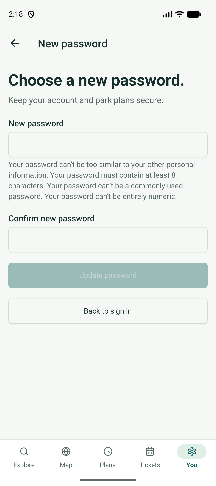
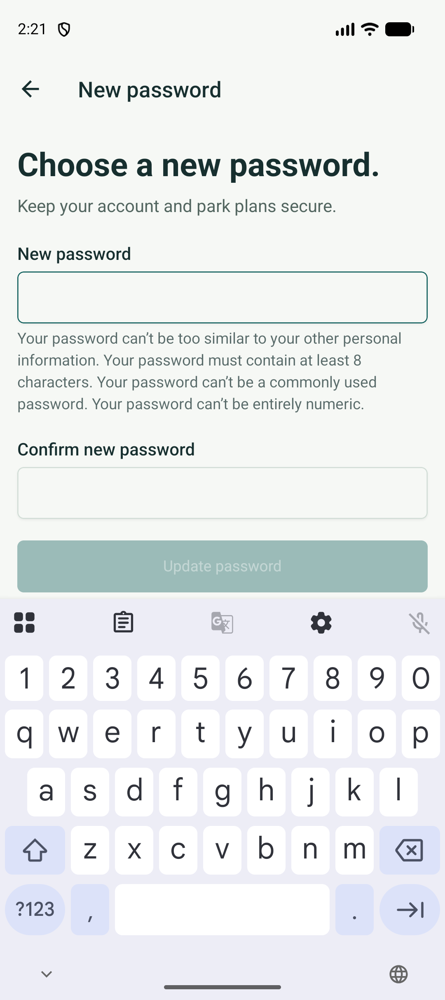

A live HTTP client changed the disposable test account's password. Its previous
API token was rejected, reuse of the reset link returned 400, and the new password
signed in successfully. Reopening the used link on the Pixel showed the recovery
message. Request a new link → Back to sign in → Create an account navigated
correctly. No new password was entered or submitted through the native UI.

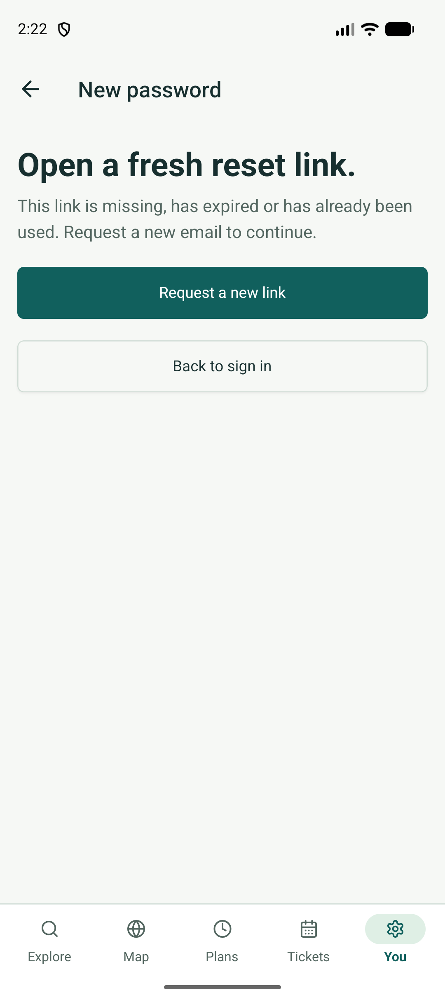
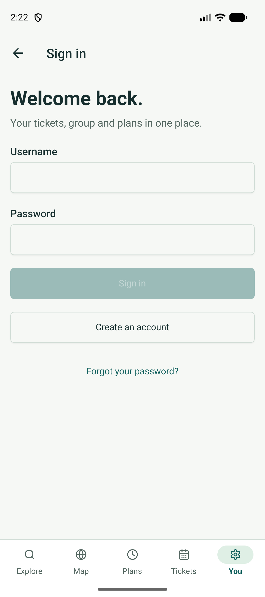

This check exposed two native deep-link issues: Expo Router 57's custom-scheme
extractor drops fragments, and a global parameter update before the root
navigator is ready throws on cold launch. The supported native-intent hook now
preserves the recovery fragment, and the screen updates its own navigator.
A regression check uses the installed Router extractor. The separate upstream
initial-link state-update warning described above still occurred on one cold
launch; it was inspected and dismissed for the form check, not suppressed.

All 65 backend tests, nine frontend tests, system/migration checks, type checking,
lint and combined web/Android/iOS JavaScript exports passed. No dependency or
native configuration changed. The live hierarchy audit again found no mismatches.
Desktop recovery/hydration, UI submission/success, large-font recovery and
screen-reader checks remain open. Safari's computer-use connection currently
returns `cgWindowNotFound`; Chrome on the emulator awaits user confirmation of
its first-run terms. No browser result is inferred from the static export.

## Installed visitor workflow — 16 September 2026

The installed Pixel 10 debug app completed sign-in, profile editing, visit booking
for 17 September with one guest, guest name/age/height editing, park-pass QR
display, map/ride browsing, the native date picker, group/time selection, ride
confirmation, ride-pass QR display and cancellation. Registration for this
disposable account used HTTP; registration UI submission was not repeated.

Guest edits survived an app restart. The walkthrough exposed missing save
feedback: the form now confirms a successful save, clears that message on edits
and disables its fields while saving. The screenshot below is cropped to exclude
the test pass's QR code.

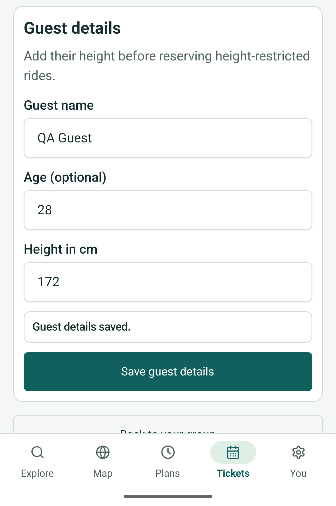

Confirming from the map originally created both reservations but left the booking
form open: `dismissTo` sent a stack-only POP_TO action to the JavaScript tabs.
Completion now dismisses within the Plans stack or navigates across tabs.
Returning to the originating tab shows a saved confirmation with no repeat
submission action; Back to map retained pin 2. Explicit ride/date route changes
reset the form's local state. The final repeat used the map reservation deep link
for 17 September after selecting pin 2; the earlier reproduction reached that
same form through map pin → ride details → Reserve a ride.

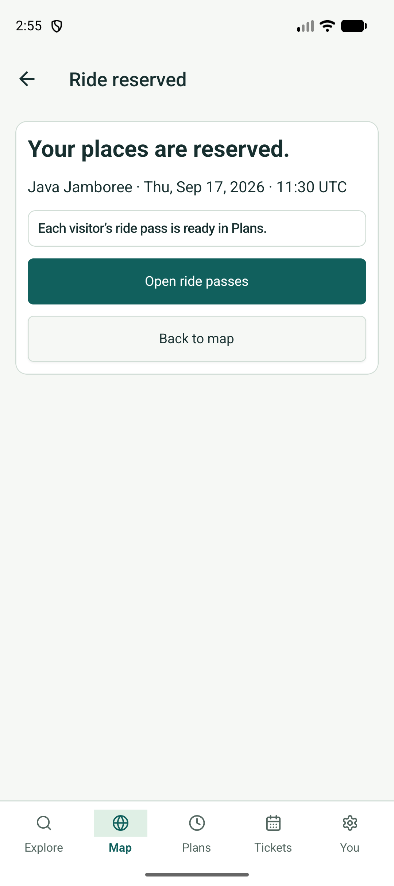

The next-pass banner opened the holder's 09:30 ride pass. Keep reservation
dismissed its confirmation without changing the reservation. Confirm cancellation
then returned to Plans and removed only the holder's seat; the guest's 09:30
reservation remained. Stored records confirmed the profile and guest updates,
eight reservations across the verification attempts and seven after cancellation.

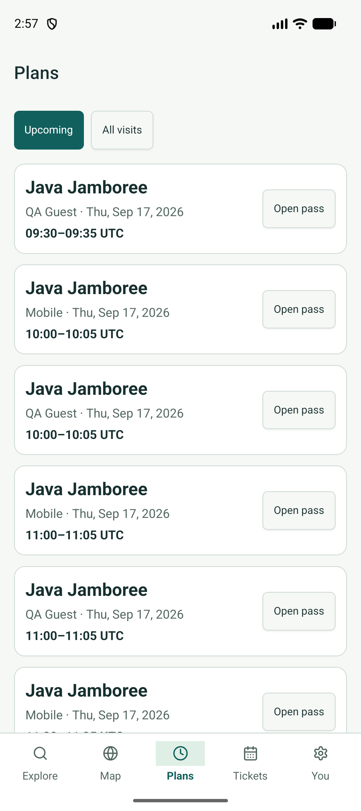

An intermediate attempt to pop the source stack and change tabs together caused
an Android `addViewAt`/SVG-parent rendering error. That sequence was removed.
The final sequence uses one navigation action and an explicit saved state; no
`addViewAt` failure appeared in its app process. This is a targeted reproduction
and repeat, not an exhaustive native crash test. The separate initial-link
development warning remains open. Active tab backgrounds also need a further
visual check: later captures show square corners where earlier captures show
rounded backgrounds.

Nine frontend tests, type checking, lint and all three JavaScript exports pass.
The unchanged backend has 65 passing tests from the recovery checkpoint.
The test visitor signed out, the demo session was restored, and all temporary
visitor/ticket/guest/reservation records and credential fixtures were removed.
The original six tickets remain; the hierarchy audit reports no mismatches.
No historical database, dependency or native build configuration changed.

The map-origin completion and cancellation above were verified in the installed
Android app. Explore/Plans-origin completion, web back links, explicit-date
deep-link replacement and screen-reader announcements still need runtime checks.
This pass does not establish large-font coverage, release FPS or iOS runtime.

## Checks still required

Reset confirmation is migrated with the remaining checks listed above. Staff
CRUD and shared visitor web entry routes are implemented; their complete browser
walkthrough remains open. Legacy POST templates remain for compatibility until
that parity check. Visitor forms need a desktop walkthrough. Complete large-font,
screen-reader and long-history coverage remains beyond the sampled phone checks.
Avatar selection is intentionally consolidated into initials until usable assets
exist, as recorded in the migration plan. No physical device, iOS simulator,
native release binary or app-store installation has been verified.

## Selected native tab shape — 16 September 2026

The installed Pixel 10 app initially rendered Explore's selected background as
a capsule, but switching to another tab produced square corners. Returning to
Explore also lost its rounding. The five icon containers now use
`collapsable={false}` so inactive, unpainted containers retain their native views.
The radius and shared color tokens are unchanged.

After restarting Metro and the app, Explore → Map → Plans → Tickets → You →
Explore → Map preserved the rounded highlight on every selected tab. Screenshots
below show the original Map failure and each corrected state. Type checking,
lint and all nine frontend tests passed. This is installed Android debug
verification; iOS runtime and release performance were not measured.

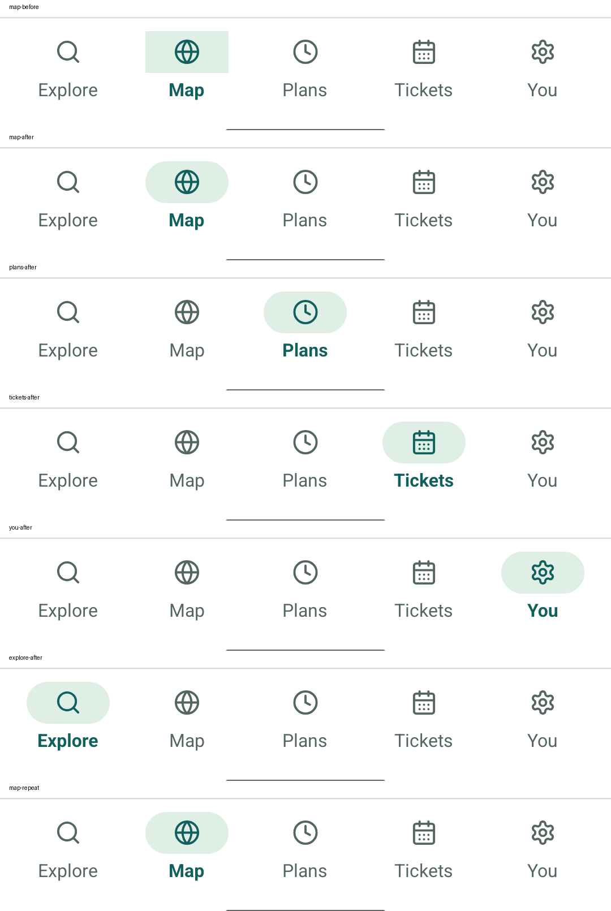

## Visitor web entry compatibility — 16 September 2026

GET and HEAD requests to the former Django booking and ticket-login pages now
redirect to `/book-visit` at the configured `VIRTUALQ_WEB_ORIGIN`. Neither supplied
`next` nor other query parameters select the redirect destination. The shared
app retains its API session or asks for sign-in before booking. A Django session
does not become an API credential.

Already-open login and booking forms retain their POST validation, session
authentication, party-reduction confirmation and QR responses. Their templates
remain pending browser parity; the compatibility QR page now links to the
configured frontend instead of a fixed development-machine IP.

All **67 backend tests** passed on disposable file-backed SQLite, along with
system and migration-drift checks. Live GET/HEAD checks returned 302 and
`no-store`; the redirected frontend route returned HTTP 200 HTML. The local
hierarchy audit again reported zero mismatches. No catalog or visitor records
were created or changed during these HTTP checks.

Browser inventory remains empty and Safari control returns `cgWindowNotFound`.
This checkpoint does not verify browser sign-in/booking, legacy POST-to-modern
handoff, staff row edits/deletion/admission or desktop accessibility. Removal of
compatibility forms remains conditional on those checks.

## Compact phone and large-text checks — 16 September 2026

The installed Pixel app was checked at 840 × 1470 px, density 420
(320 × 560 dp), with font scale 1.6. Profile fields remained scrollable, and
the save/cancel controls were reachable. The visit form exposed both Save visit
and Back to tickets; Back returned to the ticket list without submitting a
booking. No profile values or visitor records were changed.

The check reproduced truncated Explore, Plans and Tickets tab labels. Native
labels now use `adjustsFontSizeToFit` with `minimumFontScale={0.8}` alongside the
existing one-line/max-multiplier settings. Explore and Tickets selection both
retain full labels and rounded highlights at the tested size. Content text still
uses the system's scaling; accessibility labels and touch targets are unchanged.

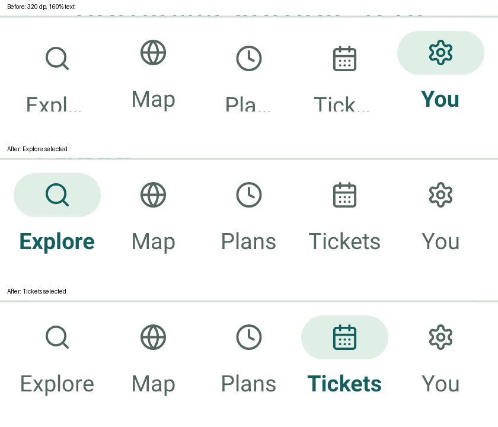
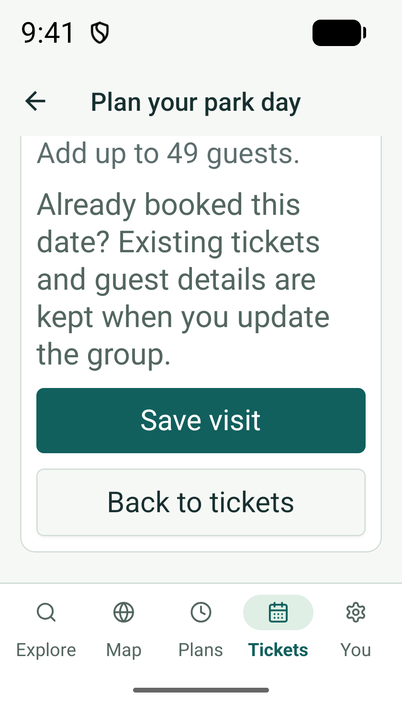

Type checking, lint, all nine frontend tests and Android/iOS/web JavaScript
exports passed. The original 1080 × 2424 px size, density 420,
font scale 1.0, input method and hardware-keyboard preference were restored.
Gboard opened a floating stylus/number pad during the profile check, so this does
not establish docked-keyboard behavior at the compact size. TalkBack, iOS runtime
and a complete large-text screen sweep remain open.

## Shared form contrast — 16 September 2026

Input and Select boundaries now use a dedicated, stronger input token.
The Profile screen was visually checked in the installed Android app after a
fresh Metro bundle. Empty and populated fields retained their layout, and
their outlines were clearer against the white card. No values were saved.

Calculated light and dark boundary, placeholder and focus ratios, before/after
screenshots and the remaining coverage are in [the accessibility review](ACCESSIBILITY.md).
The app currently forces light mode; dark token calculations are not dark-mode
runtime verification.

## Native registration and booking paths — 16 September 2026

Code: `5f4748d`, installed Pixel 10 debug app, fresh Metro bundle and local API.
No application code changed for this pass.

Starting signed out, selecting Tickets opened sign-in. Create an account retained
that destination. The native form submitted a temporary visitor with matching
passwords and a 175 cm height, then opened the empty Tickets screen. You showed
the created profile rather than a stale registration form.

After signing out, Explore → Python Plunge → Reserve a ride requested sign-in.
Successful sign-in returned to Python Plunge's reservation form. Book a park
visit saved one admission ticket for 16 September. Returning to Explore retained
the reservation route and refreshed its available visitors.

Selecting the holder, reviewing 09:00 and confirming opened Plans with one
Python Plunge reservation. Returning to Explore showed the saved confirmation
without another submission action. Back to Explore returned to the ride list,
where the next-pass banner appeared.

The installed-app deep link
`virtualq:///(visitor)/(plans)/reserve/2?date=2026-09-16` opened Java Jamboree within
the Plans stack. With the holder selected, 09:00 was unavailable because of the
existing reservation. Selecting 09:30, reviewing and confirming returned to
Plans with both reservations. This verifies the direct Plans route; it is not
evidence of an additional booking entry point in the Plans list.

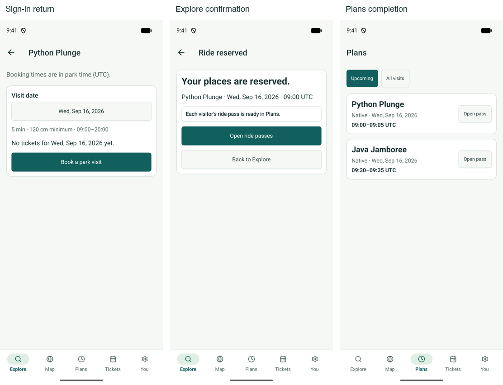

Stored records matched the entered profile, one admission ticket and the two
five-minute ride reservations. Sign-out revoked the test token. The temporary
visitor and attached records were removed, the local credential fixture was
deleted, and the original demo session was restored through native sign-in.
The original six tickets remain. No catalog or historical database was changed.

This closes the native signup submission and Explore/Plans completion checks
from earlier checkpoints. Browser equivalents, password-reset UI submission,
screen-reader feedback, iOS runtime and release performance remain unverified.
