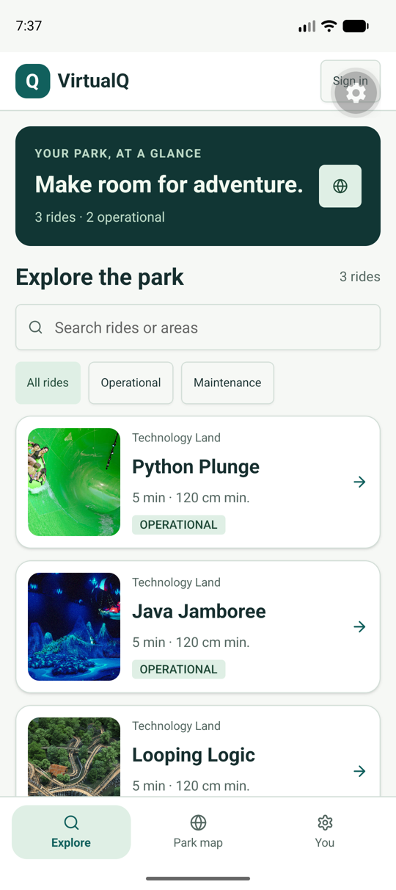
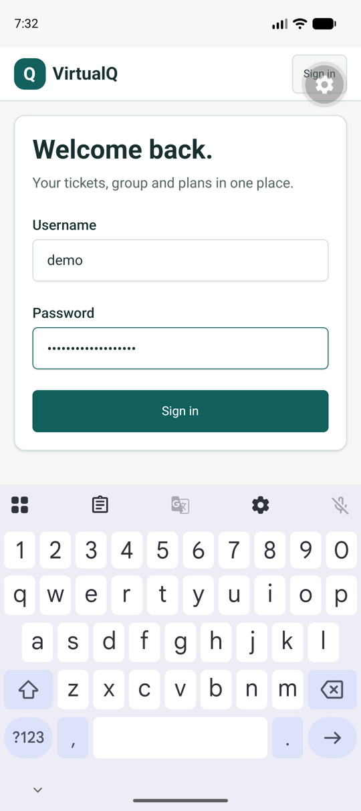
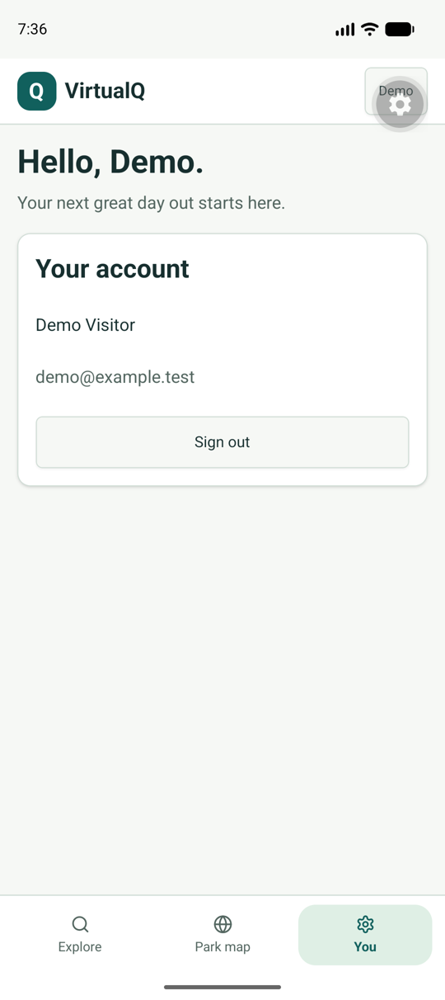

# Product verification

## Foundation — 15 September 2026

Environment: Pixel 10 Android Studio emulator, Android 17 / API 37, arm64,
1080 × 2424 px, density 420; Expo Go 57.0.9. Local Django demo data only.
Native screenshots and taps used ADB after the computer-control tool could not
attach to the emulator window.

Verified on the actual emulator:

- Explore loads real API ride names, local images and maintenance status.
- Search for “Python” reduces the list to Python Plunge.
- Bottom navigation reaches the provisional map and account screen.
- Map pin 2 selects Java Jamboree; its details action opens that ride.
- Sign in as the demo visitor with the software keyboard open. Both fields and
  the submit action remain visible, and the bottom tabs yield space to the keyboard.
- Successful authentication closes the keyboard and displays the demo profile.
- Force-stop and reopen Expo Go: the saved secure token restores the demo session.
- Sign out returns to Explore with the unauthenticated header.

Screenshots use seeded demo data. The floating gear is Expo Go's development
overlay. These are runtime captures, not design mockups:

| Explore | Sign in with keyboard | Restored account |
| --- | --- | --- |
|  |  |  |

The first native renders revealed a responsive compiler regression in
UniWind 1.12.0 / Tailwind 4.3.3. The pinned UniWind 1.11.0 / Tailwind 4.3.2
combination renders the phone layout correctly. The map also exposed an
unnecessary clipped decorative label; it was removed. The large ride-detail
image/title were reduced after visual inspection; that final sizing needs the
next walkthrough.

Automated foundation checks: clean `npm ci`, TypeScript, ESLint and
`expo install --check` pass. Web static export passes (seven routes; 1.7 MB JS,
42 KB CSS); Android/iOS Hermes exports pass (3.6/3.3 MB). These are JavaScript
exports, not native binary builds. Source checks now exclude generated exports:
the first parallel export/typecheck exposed a stale generated-file inclusion.
The scoped xcode UUID override generated 100 unique valid project identifiers.
The npm high-severity audit gate passes with three tracked moderate findings.
Draft PR: [#2](https://github.com/yagoTobi/VirtualQ-Final-Version/pull/2).
GitGuardian scanned the initial four commits without finding new secrets.
GitHub rejected the first workflow before running jobs because `runner.temp` was
used in job-level `env`, where the runner context is unavailable. The test path is
now set at step scope. The corrected push and PR runs passed at `c4b68f9`
([PR run](https://github.com/yagoTobi/VirtualQ-Final-Version/actions/runs/34939340782)),
including all 22 backend tests, clean npm install, types/lint, dependency alignment,
the high-severity audit gate and web/Android/iOS exports.

The shared HTTP client now combines screen cancellation with its own timeout;
previously supplying a screen signal bypassed the timeout. Two Node regression
tests cover both abort paths, an already-cancelled request, authentication headers,
structured API errors and empty cancellation responses. These use the actual
TypeScript client with mocked platform imports/network and add no test dependency.

## Checks still required

Registration/reset, group/profile editing, booking, reservations, cancellation,
QR display/scanning and staff CRUD need the same native/web walkthrough after
migration. Additional large-font, screen-reader, smaller-phone and desktop checks
remain. No physical device, iOS simulator, native release binary or app-store
installation has been verified.

## Reservation regression pass

All 22 backend tests pass with `DJANGO_TEST_DATABASE_PATH` set to a fresh temporary
SQLite file. Coverage now includes opening/closing boundaries, same-day past
times, absent height, cross-ride overlap, adjacent intervals, peak occupancy,
batch rollback, released capacity, rescheduling, admission fields, preserved
duration and malformed filters. Two concurrent connections competing for one seat
produce exactly one successful booking. This is API/database evidence; native
reservation forms still need migration and the subsequent walkthrough.
